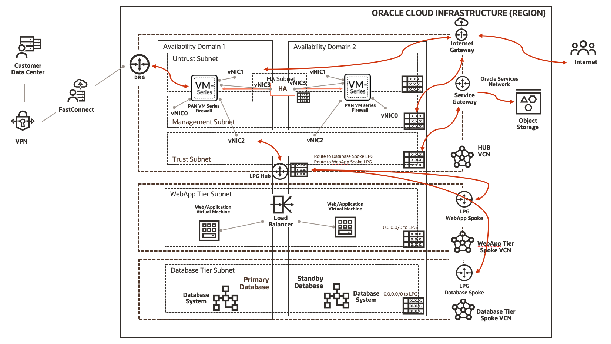
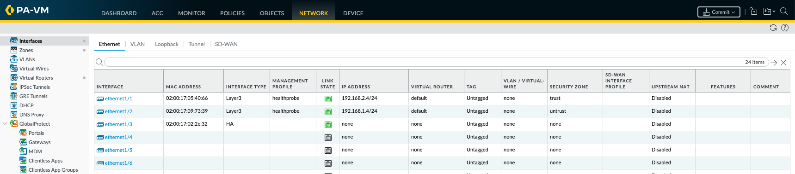
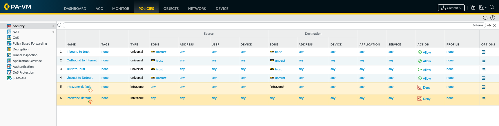
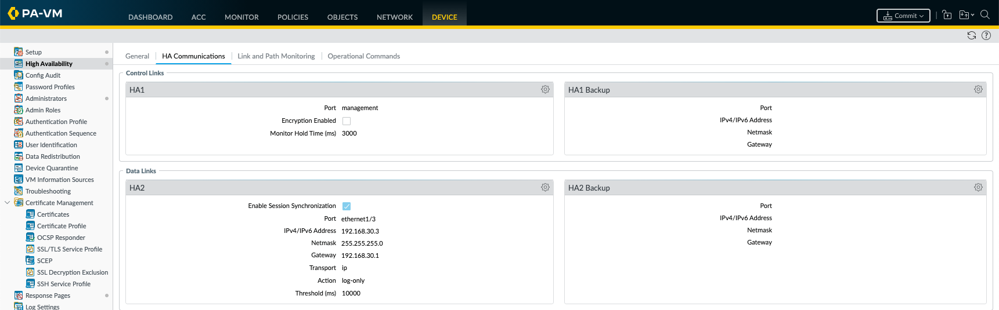
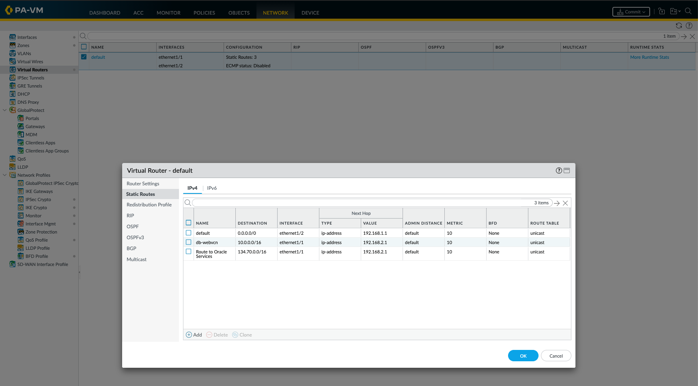
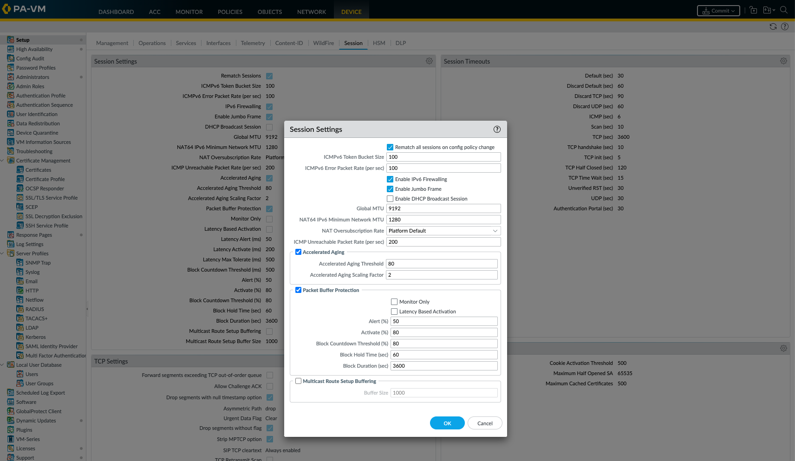

# Palo Alto Networks High Availability Active/Passive on OCI - Reference Architecture

We are using hub-and-spoke architecture (often called as star topology) to achieve High Availability with Palo Alto Networks VM Sereis Firewall. This architecture has a central component (the hub) that's connected to multiple networks around it, like a spoke. We are using Palo Alto Networks VM series firewall BOYL Listing from OCI Marketplace.

For details of the architecture, see [_Set up a hub-and-spoke network topology_](https://docs.oracle.com/en/solutions/hub-spoke-network/index.html).

## Architecture Diagram




## Prerequisites

You should complete below pre-requisites before proceeding to next section:
- You have an active Oracle Cloud Infrastructure Account.
  - Tenancy OCID, User OCID, Compartment OCID, Private and Public Keys are setup properly.
- Permission to `manage` the following types of resources in your Oracle Cloud Infrastructure tenancy: `vcns`, `internet-gateways`, `route-tables`, `security-lists`, `local-peering-gateways`, `subnets`, `dynamic-groups` and `instances`.
- Quota to create the following resources: 3 VCNS, 6 subnets, and 6 compute instance.

If you don't have the required permissions and quota, contact your tenancy administrator. See [Policy Reference](https://docs.cloud.oracle.com/en-us/iaas/Content/Identity/Reference/policyreference.htm), [Service Limits](https://docs.cloud.oracle.com/en-us/iaas/Content/General/Concepts/servicelimits.htm), [Compartment Quotas](https://docs.cloud.oracle.com/iaas/Content/General/Concepts/resourcequotas.htm).


## Deployment Options

You can deploy this architecture using two approach explained in each section: 
1. Using Oracle Resource Manager 
2. Using Terraform CLI 

## Deploy Using Oracle Resource Manager

In this section you will follow each steps given below to create this architecture:

1. Click [](https://console.us-phoenix-1.oraclecloud.com/resourcemanager/stacks/create?region=home&zipUrl=https://github.com/oracle-quickstart/oci-paloaltonetworks/raw/master/paloaltonetworks-ha/resource-manager/pan-ha.zip)

    > If you aren't already signed in, when prompted, enter the tenancy and user credentials.

2. Review and accept the terms and conditions.

3. Select the region where you want to deploy the stack.

4. Follow the on-screen prompts and instructions to create the stack.

5. After creating the stack, click **Terraform Actions**, and select **Plan** from the stack on OCI console UI.

6. Wait for the job to be completed, and review the plan.

    > To make any changes, return to the Stack Details page, click **Edit Stack**, and make the required changes. Then, run the **Plan** action again.

7. If no further changes are necessary, return to the Stack Details page, click **Terraform Actions**, and select **Apply**. 

8. At this stage your architecture should have been deployed successfully. You can proceed to next section for configuring your Palo Alto Networks VM Series Firewall.

9. If you no longer require your infrastructure, return to the Stack Details page and **Terraform Actions**, and select **Destroy**.


## Deploy Using the Terraform CLI

In this section you will use **Terraform** locally to create this architecture: 


1. Create a local copy of this repo using below command on your terminal: 

    ```
    git clone https://github.com/oracle-quickstart/oci-paloaltonetworks.git
    cd oci-paloaltonetworks/paloaltonetworks-ha/
    ls
    ```

2. Complete the prerequisites described [here] which are associated to install **Terraform** locally:(https://github.com/oracle-quickstart/oci-prerequisites#install-terraform).
    Make sure you have terraform v0.13+ cli installed and accessible from your terminal.

    ```bash
    terraform -v

    Terraform v0.13.0
    + provider.oci v4.14.0
    ```

3. Create a `terraform.tfvars` file in your **paloaltonetworks-ha** directory, and specify the following variables:

    ```
    # Authentication
    tenancy_ocid         = "<tenancy_ocid>"
    user_ocid            = "<user_ocid>"
    fingerprint          = "<finger_print>"
    private_key_path     = "<pem_private_key_pem_file_path>"

    # SSH Keys
    ssh_public_key  = "<public_ssh_key_string_value>"

    # Region
    region = "<oci_region>"

    # Compartment
    compute_compartment_ocid = "<compartment_ocid>"
    network_compartment_ocid = "<network_compartment_ocid>"
    availability_domain_number = "<availability_domain_number>

    ````

4. Create the Resources using the following commands:

    ```bash
    terraform init
    terraform plan
    terraform apply
    ```

5. At this stage your architecture should have been deployed successfully. You can proceed to next section for configuring your Palo Alto Networks VM Series Firewall. 

6. If you no longer require your infrastructure, you can run this command to destroy the resources:

    ```bash
    terraform destroy
    ```

## Palo Alto Networks Firewall Configuration 

This section will include necessary configuration which you need to configure to support HA (active/passive) use-case. 

Once you deploy the infrastructure either using Oracle Resource Manager or Terraform CLI. We have to upload configuration on Palo Alto Networks VM series Firewall. 


> This section will be automated as Palo Alto Networks personal add bootstrap configuration using either user-data or bucket. You can follow  [Config Directory](./config-ha) directory for the time being to support routes, policies, interfaces, HA config. 

Before you proceed to next section, you should setup a admin password through CLI (Instrcutions are printed after a successful run of this code) using below commands: 

```
1.  Open an SSH client.
2.  Use the following information to connect to the instance
username: admin
IP_Address: ${oci_core_instance.ha-vms.0.public_ip}
SSH Key
For example:
$ ssh –i id_rsa admin@${oci_core_instance.ha-vms.0.public_ip}
3.  Set the user password for the administrator. 
    - Enter the command: set user admin password
    - Change the password using command: set mgt-config users admin password
4. Save the configuration. Enter the command: commit
After saving the password, you should run the first time wizard in the VM Series UI:
1.  In a web browser, 
    - Connect to the VM Series UI Firewall-1: https://${oci_core_instance.ha-vms.0.public_ip}
    - Connect to the VM Series UI Firewall-2: https://${oci_core_instance.ha-vms.1.public_ip}
```

## Firewall-1 Configuration 

We have added required configuration for Palo Alto Networks Firewall 1 (HA Cluster First Instance) [Firewall A Configuration](./config-ha/firewallA.xml). You can use this as a reference and upload this on your Firewall. Configuration should be same but you can compare your configuration with your Firewall Instances.

1. Connect to Firewall UI 
2. Go to Device > Operation Tab 
3. Select Import Configuration and Choose FirewallA.xml file described here. 
4. Now Select Load Configuration and choose file from dropdown which you just imported. 
5. Verify Configuration; Interfaces, Security Policies, NAT Policies, Default Routes, Address Objects
6. Commit your changes


Once you commit your change you won't be able to use your previously set admin password, you should use `admin/Pal0Alt0@123` login details to UI now. 

At some point you will need to enable jumbo frame you can do this using below steps: 
1. Connect to Firewall UI 
2. Select Device > Session > Setting > Setting button 
3. Check jumbo frame icon. 

## Firewall-2 Configuration 

We have added required configuration for Palo Alto Networks Firewall 2 (HA Cluster Second Instance) [Firewall B Configuration](./config-ha/firewallB.xml). You can use this as a reference and upload this on your Firewall. Configuration should be same but you can compare your configuration with your Firewall Instances.

1. Connect to Firewall UI 
2. Go to Device > Operation Tab 
3. Select Import Configuration and Choose FirewallA.xml file described here. 
4. Now Select Load Configuration and choose file from dropdown which you just imported. 
5. Verify Configuration; Interfaces, Security Policies, NAT Policies, Default Routes, Address Objects
6. Commit your changes

Once you commit your change you won't be able to use your previously set admin password, you should use `admin/Pal0Alt0@123` login details to UI now. 

At some point you will need to enable jumbo frame you can do this using below steps: 
1. Connect to Firewall UI 
2. Select Device > Session > Setting > Setting button 
3. Check jumbo frame icon. 


## Some Sample Configuration Pics on Palo Alto Networks Firewall 

I am attaching some sample configuration from one of the Firewall-B for your reference as below: 

1. Interfaces Configuration 
    - Ethernet1/1 ; Trust Interface 
    - Ethernet1/2 ; Untrust Interface 
    - Ethernet1/3 ; HA Interface




2. Security Policies 
    - Untrust to Trust and Vice Versa 
    - Intra Zone Policies 



3. HA Communication 
    - HA 1 is tied to Managment Interface 
    - HA 2 is tied to ethernet1/3 interface 




4. Default Routes Configuration 
    - Default route via untrust interface gateway (eth1/2)
    - Static Routes for Spoke VCNs and Oracle Storage Networks via trust interface gateway (eth1/1)



5. NAT Policies 
    - We have two NAT policies 
        - First: Traffic to Web Spoke VCN so end user can connect to VM from outside using public IP of untrust interface of Firewall (Floating IP)
        - Second: Traffic towards interent from Spoke VCNs

6. Jumbo Frame Configuration 
    - End user need to enable this manually and restart each firewall VM afterwards. 
    - Below image shows where you need to go to enable jumbo frame. 




## Feedback 

Feedbacks are welcome to this repo, please open a PR if you have any.